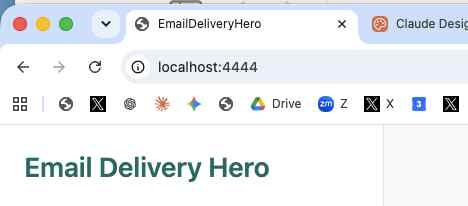
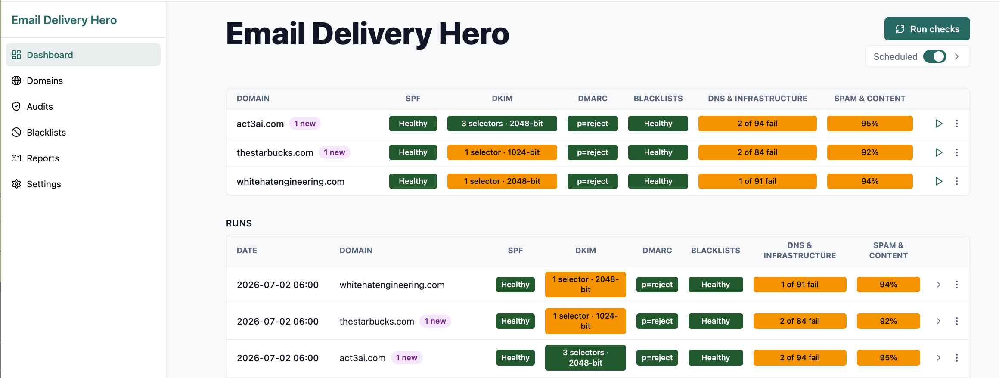
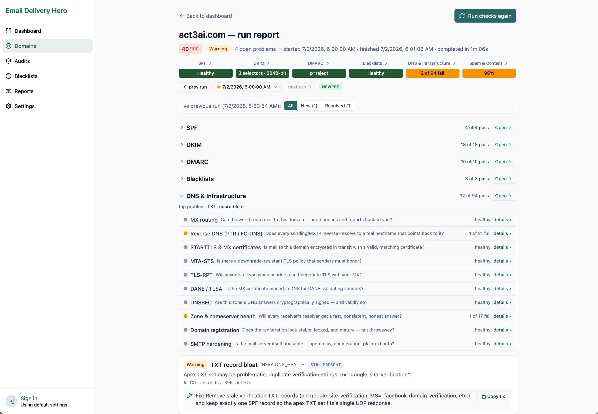
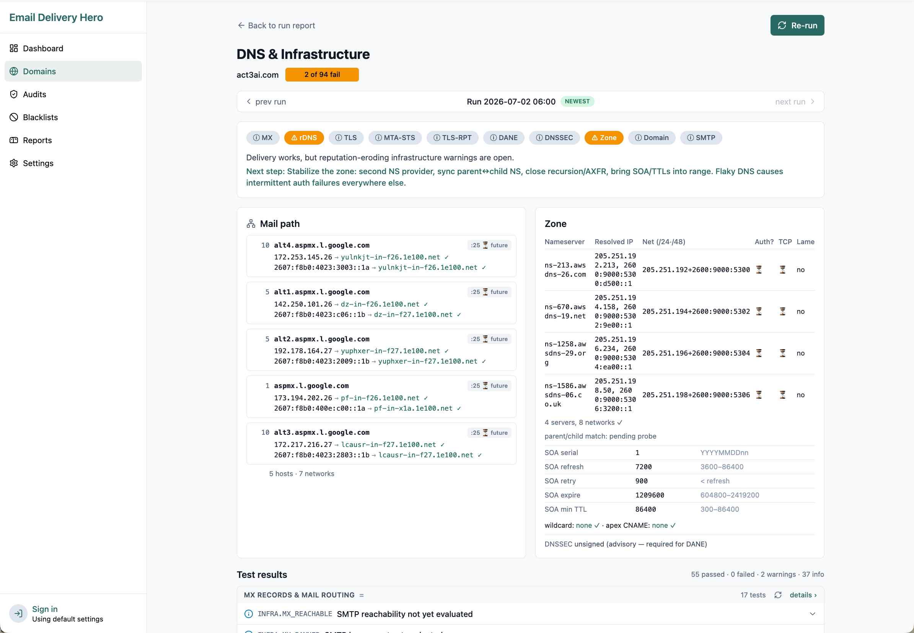
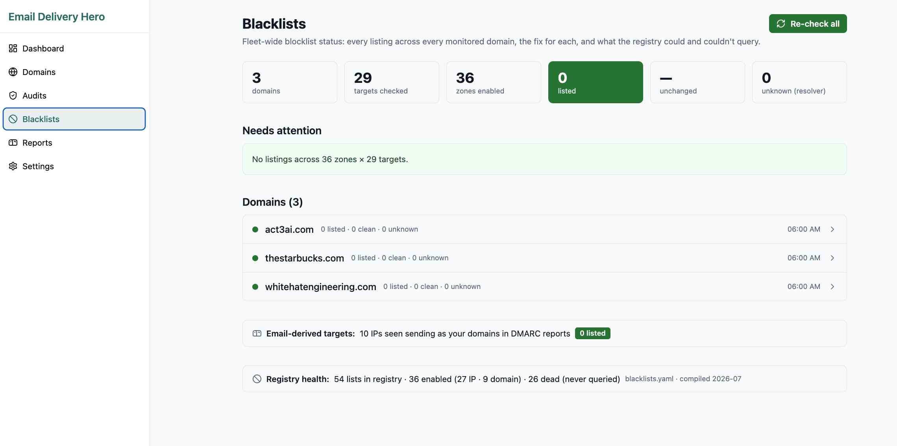
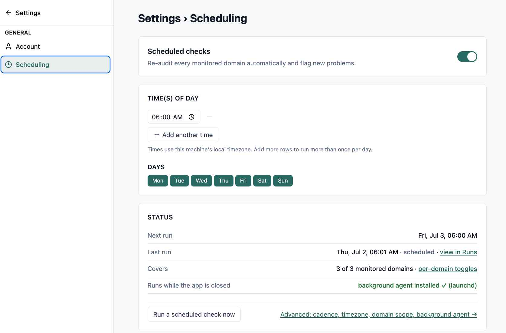

# EmailDeliveryHero

**New domain? Your email is probably landing in spam. EmailDeliveryHero shows you exactly what's misconfigured — and how to fix it.**

You set up a new domain, wired up email, and started sending — but your messages keep landing in the spam folder, or never arrive at all. It's almost never your writing. It's the invisible setup behind your domain: the DNS records and authentication that prove to Gmail, Outlook, and Yahoo that your mail is really you. When those aren't configured correctly, mailbox providers quietly filter you to spam. EmailDeliveryHero is a free app you run on your own computer that inspects that setup the same way the big mailbox providers do, finds what's missing or wrong, and hands you the exact fix for each problem.

---

## Why This Exists

A brand-new domain starts with no reputation and, usually, none of the records that mailbox providers look for before they trust your mail — so your email gets sent to spam or silently dropped. The worst part: there's no bounce and no error message. Your email just doesn't show up, and you're left guessing why.

EmailDeliveryHero closes that gap. Point it at your domain and it tells you, in plain terms, whether the things that decide inbox-vs-spam are set up right: Is your email authenticated (SPF, DKIM, DMARC)? Is your domain or sending IP on a blacklist? Is anything misconfigured or missing? And for every problem it finds, it gives you the precise fix — the exact record to add to your DNS, the setting to change, the form to file — so you can go from "landing in spam" to "landing in the inbox."

---

## What It Does

* **Checks the domain you send from** — add your domain and run a full deliverability health check in one click. No prior expertise required.
* **Finds what's sending you to spam** — missing or broken email authentication (SPF / DKIM / DMARC), blacklist listings, DNS mistakes, insecure mail transport, and spam-triggering message content.
* **Tells you exactly how to fix it** — every problem comes with a plain-English severity (`ok` / `info` / `warning` / `critical`) and a concrete fix: the exact DNS record to publish, the setting to change, the delisting steps to follow. Never just a red light with no answer.
* **Keeps watching** — re-checks your domain automatically on a schedule, so if something breaks or a new problem appears, you find out the day it happens instead of months later.
* **Reads the reports mailbox providers send back** — ingests the DMARC and TLS-RPT report emails receivers send you, to reveal spoofing, senders impersonating your domain, and silent delivery failures you'd otherwise never see.
* **Shows it all on one dashboard** — a single health view per domain, with drill-down pages for every check and every fix.

---

## Getting Started

Requirements: **macOS or Linux**, [Homebrew](https://brew.sh/), and Brew-installed `node` (>= 20), `pnpm`, and [`just`](https://github.com/casey/just).

```bash
# 1. Clone the repository (and its auth library as a sibling)
git clone https://github.com/BryanStarbuck/EmailDeliveryHero.git
git clone https://github.com/BryanStarbuck/OpenAuthFederated.git
cd EmailDeliveryHero

# 2. Build — installs deps, compiles frontend + backend,
#    and installs the scheduled-audit agent
just build

# 3. Run — starts the web app in the background
just run

# 4. Open http://localhost:4444/ in your browser
```

Then add the domains you send from, click **Run checks**, and work the findings.

Other useful recipes:

```bash
just status   # is the app / scheduler running?
just logs     # follow the web app log
just stop     # shut it down
just dev      # run with backend watch-mode (for hacking on the code)
```

---

## Screenshots

_Click any screenshot to open it full size._

Once you have it running on your local computer, then navigate to localhost:4444 to use it.

<a href="pm/images/Large_File_Brdige_6.jpeg"></a>

**Dashboard** — one row per domain with six color-coded category cells, plus the full run history below.

<a href="pm/images/Large_File_Brdige_1.jpeg"></a>

**Run report** — a domain's overall score, the six categories, and a per-check pass/fail breakdown with a copy-paste fix for every finding.

<a href="pm/images/Large_File_Brdige_3.jpeg"></a>

**DNS & Infrastructure detail** — mail path, nameserver/zone health, and the underlying test results behind one category cell.

<a href="pm/images/Large_File_Brdige_2.jpeg"></a>

**Blacklists** — fleet-wide blocklist status across every monitored domain and sending IP, with per-zone delisting steps.

<a href="pm/images/Large_File_Brdige_4.jpeg"></a>

**Scheduling** — recurring, unattended re-audits via the OS-native scheduler, configurable by time and day.

<a href="pm/images/Large_File_Brdige_5.jpeg"></a>

---

## The Checks

Every audit runs checks across **six categories**. Each category rolls up into one color-coded dashboard cell; each check produces findings with a severity and a fix.

| Category | What it covers |
| --- | --- |
| **SPF** | A single valid `v=spf1` record, the 10-DNS-lookup limit, the terminal `all` qualifier, syntax, and DMARC alignment. |
| **DKIM** | Per-selector public-key presence and parseability, key length (RFC 8301), rotation headroom, CNAME-delegated selectors. |
| **DMARC** | Policy presence and enforcement (`none` → `quarantine` → `reject`), alignment, subdomain policy, `rua`/`ruf` reporting, plus ARC for forwarded mail. |
| **Blacklists** | Your domains and sending IPs against the major DNSBLs/RHSBLs — Spamhaus ZEN/SBL/XBL/PBL/DBL, Barracuda, SpamCop, SORBS, UCEPROTECT, Invaluement, SURBL — with per-zone delisting steps. |
| **DNS & Infrastructure** | MX records and mail routing, reverse DNS / PTR / FCrDNS, STARTTLS and MX certificate health, MTA-STS, TLS-RPT, DANE/TLSA, DNSSEC, nameserver/zone health and dangling-record risk, WHOIS/RDAP domain reputation, SMTP server hardening (open relay, VRFY/EXPN). |
| **Spam & Content** | SpamAssassin-style content scoring of a sample message, BIMI, List-Unsubscribe / one-click (the 2024 Gmail/Yahoo bulk-sender rules), link/URL reputation against URI blocklists, sender-reputation metrics, and seed-list inbox placement across Gmail, Outlook, Yahoo, and Apple. |

The full engineering spec for every check — sub-checks, detection method, UI, schema, and remediation — lives under [`pm/checks/`](./pm/checks/overview.mdx).

---

## List of What we Check

Every audit runs the following checks. This is the exact, code-verified list of
registered checkers in the audit engine
([`code/packages/backend/src/modules/audit/checks/`](./code/packages/backend/src/modules/audit/checks/)),
grouped by the six dashboard categories. Each checker produces one or more
findings, each with a severity (`ok` / `info` / `warning` / `critical`) and a
concrete remediation.

**SPF**

1. **SPF record** — a single valid `v=spf1` record exists; syntax is well-formed;
   the terminal `all` qualifier is present and correctly set; every `include` /
   `redirect` / `a` / `mx` mechanism resolves; the RFC 7208 **10-DNS-lookup limit**
   is not exceeded; no recursion loops; and the record aligns with DMARC.

**DKIM**

2. **DKIM keys** — for each configured selector: the public key is present in DNS
   and parseable; the key length meets RFC 8301 (flags short/weak keys);
   CNAME-delegated selectors resolve; and rotation headroom is assessed.

**DMARC**

3. **DMARC record** — a valid `v=DMARC1` record exists; policy enforcement level
   (`none` → `quarantine` → `reject`); `sp` subdomain policy; alignment mode;
   `pct`; and `rua` / `ruf` reporting addresses.
4. **DMARC reports** — parses ingested DMARC **aggregate (`rua`) XML** report
   emails to reveal unauthorized senders, SPF/DKIM alignment gaps, and spoofing
   seen in the wild by receivers.
5. **ARC (Authenticated Received Chain)** — for declared forwarders / mailing
   lists, verifies the ARC signer domain/selector so legitimately forwarded mail
   survives DMARC.

**Blacklists**

6. **DNS blacklists** — checks your domains and sending IPs against the major
   DNSBLs / RHSBLs (Spamhaus ZEN/SBL/XBL/PBL/DBL, Barracuda, SpamCop, SORBS,
   UCEPROTECT, Invaluement, SURBL) and provides per-zone delisting steps.

**DNS & Infrastructure**

7. **MX & Mail Routing** — MX records are present and resolve; mail-routing
   sanity.
8. **Reverse DNS / PTR** — PTR records exist for sending IPs (IPv4 and IPv6) and
   confirm forward-confirmed reverse DNS (FCrDNS).
9. **STARTTLS & MX TLS** — each MX host offers STARTTLS and presents a valid,
   in-date TLS certificate.
10. **MTA-STS** — the MTA-STS TXT record and policy are published and valid.
11. **TLS-RPT** — the TLS-RPT (`rua`) record is present, valid, and its reporting
    mailbox resolves.
12. **DANE / TLSA** — TLSA records are present and valid, with the DNSSEC
    prerequisite checked.
13. **DNSSEC** — the zone is signed and the DNSSEC chain validates (flags
    `bogus`).
14. **DNS Zone & NS Health** — nameserver and zone health: lame delegation,
    parent/child NS consistency, all-NS-answer, glue records, and
    dangling-record risk.
15. **Domain Registration Reputation** — WHOIS / RDAP domain registration
    signals, including domain expiry.
16. **SMTP Server Security** — SMTP server hardening probes (open relay,
    VRFY / EXPN exposure).

**Spam & Content**

17. **BIMI** — the BIMI record and its logo/VMC references are valid.
18. **Message Content Spam Scoring** — SpamAssassin-style scoring of a sample
    message: subject-line signals, image-to-text ratio, plain-text alternative
    (multipart/alternative), MIME well-formedness, trigger phrases / obfuscation,
    and header sanity (Message-ID, Date, forgeries).
19. **Report corpus scan** — scans the ingested report-email corpus so the DMARC
    and TLS-RPT checks read a fresh store.
20. **List-Unsubscribe & One-Click** — the `List-Unsubscribe` header and RFC 8058
    one-click unsubscribe (the 2024 Gmail/Yahoo bulk-sender rules).
21. **Link / URL Reputation** — extracts links from a sample message and checks
    them against URI blocklists.
22. **Sender Reputation Metrics** — Google Postmaster verification, FBL
    enrollment, and a trend over our own stored blacklist history (recurring
    listings). Complaint/bounce/reputation *rates* are surfaced when a reputation
    integration (Google Postmaster Tools, ESP, or FBL) is connected.
23. **Inbox Placement Testing** — seed-list inbox placement across Gmail,
    Outlook / Microsoft 365, Yahoo / AOL, and Apple iCloud. Runs when a seed list
    is configured.

> Checks **22** and **23** additionally light up when you connect a reputation
> integration or configure a seed list; until then they report status/advisory
> findings rather than pass/fail. Everything else runs against live DNS and
> mail-server probes on every audit with no extra setup.

---

## Who It Helps

| You are… | EmailDeliveryHero gives you… |
| --- | --- |
| **A deliverability owner / ops person** | One dashboard over all your sending domains, a worked list of open problems, and the fix for each. |
| **An engineer / DNS admin** | The exact record-level remediation — the SPF/DKIM/DMARC TXT to publish — ready to paste into your DNS provider. |
| **A small business or indie sender** | A free, self-hosted alternative to paid deliverability monitoring: no data leaves your machine. |
| **Anyone whose email suddenly stopped landing** | A diagnosis: which filter, which blocklist, which broken record — and how to undo it. |

---

## How It Works

EmailDeliveryHero is a **local-first web app** — a TypeScript-on-Node monorepo you run yourself:

* **Frontend:** React 19 + Vite UI at **`http://localhost:4444/`**.
* **Backend:** NestJS REST API on port **9312** (proxied at `/api`).
* **Checks engine:** pluggable checkers driven by Node's native DNS plus proven Brew-installed command-line tooling, so results reflect the same signals real mail systems use. Runs are parallel per domain with bounded concurrency.
* **Storage:** plain JSON/YAML files under `~/.email_delivery_hero/` — no database. Your domain list, run history, and findings are transparent files on your own disk.
* **Scheduling:** the OS-native scheduler (launchd on macOS, cron/systemd on Linux, Task Scheduler on Windows) fires recurring audits even when the app isn't open in a browser.

---

## Authentication (Optional)

**Login is optional.** The app is fully usable logged out as a single local `default` user. Signing in — via **[OpenAuthFederated](https://github.com/BryanStarbuck/OpenAuthFederated)**, an open source, self-hostable identity layer used much like Clerk or Auth0 — upgrades you to a per-person identity and unlocks admin-only settings. There is no email/password; sign-in is federated Google Workspace SSO, and it stays fully under your control in keeping with the local-first spirit of the project.

---

## Project Layout

```
EmailDeliveryHero/
├── code/          # the app: pnpm monorepo
│   └── packages/
│       ├── backend/    # NestJS REST API (port 9312)
│       └── frontend/   # React 19 + Vite UI (port 4444)
├── pm/            # product & engineering specs (MDX) — start at pm/overview.mdx
│   ├── checks/    # one deep spec per deliverability check topic
│   └── use_cases/ # end-to-end user flows
├── emails/        # sample corpus of real DMARC / TLS-RPT report emails
└── justfile       # build / run / stop / status
```

The [`pm/overview.mdx`](./pm/overview.mdx) file is the table of contents for every specification — the product charter, the check catalog, the UI, storage, scheduling, and error-handling specs.

---

## Contributing

EmailDeliveryHero is open source and contributions are welcome. Open an issue to report a bug or request a feature, or send a pull request.

* Everything is **TypeScript on Node** (strict) — backend, frontend, and background jobs alike.
* New deliverability checks are pluggable checkers; each starts with a spec under `pm/checks/` defining its sub-checks, detection method, and remediations.
* Prefer widely available Brew-installed tooling for probes so results stay reproducible across machines.

---

## Links

* **Repository:** https://github.com/BryanStarbuck/EmailDeliveryHero
* **Specifications:** [`pm/overview.mdx`](./pm/overview.mdx)
* **Check catalog:** [`pm/checks/overview.mdx`](./pm/checks/overview.mdx)
* **Authentication (OpenAuth Federated):** https://github.com/BryanStarbuck/OpenAuthFederated
